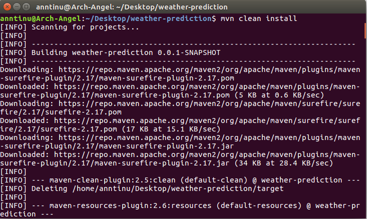
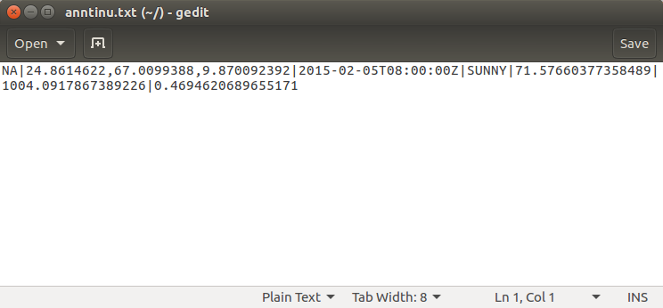
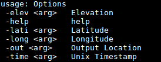

# WeatherPredictor

Machine Learning model for weather generation using Spark Random Forest Mllib Algorithm in Java.

## Background

**PROBLEM**

Create a toy simulation of the environment (taking into account things like atmosphere, topography, geography,oceanography, or similar) that evolves over time.

**Approach**
Here we need to predict the following parameters,

1. Temprature
2. Pressure
3. Humidity
4. Weather Condition(Rain/Snow/Sunny).

So for predicting the above parameters we can have three approches

1. Using Weather Prediction APIs.
2. Using Weather prediction Equation provided by different vendors.
3. Using Machine Learning approachs.

Here we are going to uses the Third approch, **ML Approach**, When considering the parameters to predict we can see that the first three(Temprature,Pressure,Humidity) are continues values, So for predicting continues values a **regression model** is the best suit, Then for weather condition prediction which is having fixed out comes we can go with **classification model**. So we are going to use a **supervised machine learning** algorithm, So we need a dataset of historical values. After obtaining dataset, Next step was **feature selection**.

The following are the set of different features selected for each parameters,

1. Temprature - Latitude, Longitude, Elevation, Month, Day of Month, Hour.
2. Pressure -  Latitude, Longitude, Elevation, Month, Day of Month, Hour.
3. Humidity - Latitude, Longitude, Elevation, Month, Day of Month, Hour.
4. Weather condition - Temprature, Pressure, Humidity, Latitude, Longitude, Elevation, Month, Day of Month, Hour.

So before continuing to next step ML Algorithm need to be selected. I had selected **Random Forest** algorithm since it is a ensemble method which uses multiple learning algorithms to obtain better predictive performance than could be obtained from any of the constituent learning algorithms alone. Here in MLLib, Random Forest uses decision tree as its base model. Random Forests can be less prone to overfitting. Training more trees in a Random Forest reduces the likelihood of overfitting. After selecting the algorithm next steps are model training, testing and improvement.

## Random Forest ML Algorithm

Random forests are ensembles of decision trees. Random forests are one of the most successful machine learning models for classification and regression. They combine many decision trees in order to reduce the risk of overfitting. Like decision trees, random forests handle categorical features, extend to the multiclass classification setting, do not require feature scaling, and are able to capture non-linearities and feature interactions.

spark.mllib supports random forests for binary and multiclass classification and for regression, using both continuous and categorical features. spark.mllib implements random forests using the existing decision tree implementation.

**Basic Algorithm**

Random forests train a set of decision trees separately, so the training can be done in parallel. The algorithm injects randomness into the training process so that each decision tree is a bit different. Combining the predictions from each tree reduces the variance of the predictions, improving the performance on test data.

**Prediction**

To make a prediction on a new instance, a random forest must aggregate the predictions from its set of decision trees. This aggregation is done differently for classification and regression.

Classification: Majority vote. Each tree’s prediction is counted as a vote for one class. The label is predicted to be the class which receives the most votes.

Regression: Averaging. Each tree predicts a real value. The label is predicted to be the average of the tree predictions.

**Parameters**

Markup : <details>
           <summary>1. algo </summary>
           <p>Classification or Regression</p>
         </details>
	<details>
           <summary>2. numClasses</summary>
           <p>Number of classes (for Classification only)</p>
         </details>
	<details>
           <summary>3. categoricalFeaturesInfo</summary>
           <p> Specifies which features are categorical and how many categorical values each of those features can take. This is given as a map from feature indices to feature arity (number of categories). Any features not in this map are treated as continuous.

* E.g., Map(0 -> 2, 4 -> 10) specifies that feature 0 is binary (taking values 0 or 1) and that feature 4 has 10 categories (values {0, 1, ..., 9}). Note that feature indices are 0-based: features 0 and 4 are the 1st and 5th elements of an instance’s feature vector.
* Note that you do not have to specify categoricalFeaturesInfo. The algorithm will still run and may get reasonable results. However, performance should be better if categorical features are properly designated.</p>
         </details>
<details>
<summary>4. maxDepth </summary>
           <p>Maximum depth of a tree. Deeper trees are more expressive (potentially allowing higher accuracy), but they are also more costly to train and are more likely to overfit.</p>
         </details>
<details>
<summary>5. minInstancesPerNode </summary>
           <p>For a node to be split further, each of its children must receive at least this number of training instances. This is commonly used with RandomForest since those are often trained deeper than individual trees.</p>
         </details>
<details>
<summary>6. minInfoGain </summary>
           <p>For a node to be split further, the split must improve at least this much (in terms of information gain).</p>
         </details>
<details>
<summary>7. subsamplingRate </summary>
           <p>Fraction of the training data used for learning the decision tree. This parameter is most relevant for training ensembles of trees (using RandomForest and GradientBoostedTrees), where it can be useful to subsample the original data. For training a single decision tree, this parameter is less useful since the number of training instances is generally not the main constraint.</p>
         </details>
<details>
<summary>8. impurity </summary>
           <p>Impurity measure used to choose between candidate splits. This measure must match the algo parameter.</p>
         </details>
<details>
           <summary>9. maxBins</summary>
           <p> Number of bins used when discretizing continuous features.

* Increasing maxBins allows the algorithm to consider more split candidates and make fine-grained split decisions. However, it also increases computation and communication.
* Note that the maxBins parameter must be at least the maximum number of categories M for any categorical feature.</p>
         </details>
<details>
           <summary>10. maxMemoryInMB</summary>
           <p> Amount of memory to be used for collecting sufficient statistics. 

* The default value is conservatively chosen to be 256 MB to allow the decision algorithm to work in most scenarios. Increasing maxMemoryInMB can lead to faster training (if the memory is available) by allowing fewer passes over the data. However, there may be decreasing returns as maxMemoryInMB grows since the amount of communication on each iteration can be proportional to maxMemoryInMB.
* Implementation details: For faster processing, the decision tree algorithm collects statistics about groups of nodes to split (rather than 1 node at a time). The number of nodes which can be handled in one group is determined by the memory requirements (which vary per features). The maxMemoryInMB parameter specifies the memory limit in terms of megabytes which each worker can use for these statistics.</p>
         </details>
<details>
           <summary>11. numTrees</summary>
           <p> Number of trees in the forest. 

* Increasing the number of trees will decrease the variance in predictions, improving the model’s test-time accuracy.
* Training time increases roughly linearly in the number of trees.</p>
         </details>
<details>
           <summary>12. maxDepth</summary>
           <p> Number of trees in the forest. 

* Increasing the depth makes the model more expressive and powerful. However, deep trees take longer to train and are also more prone to overfitting.
* In general, it is acceptable to train deeper trees when using random forests than when using a single decision tree. One tree is more likely to overfit than a random forest (because of the variance reduction from averaging multiple trees in the forest).</p>
         </details>
<details>
<summary>13. subsamplingRate </summary>
           <p>This parameter specifies the size of the dataset used for training each tree in the forest, as a fraction of the size of the original dataset. The default (1.0) is recommended, but decreasing this fraction can speed up training.</p>
         </details>
<details>
<summary>14. featureSubsetStrategy </summary>
           <p>Number of features to use as candidates for splitting at each tree node. The number is specified as a fraction or function of the total number of features. Decreasing this number will speed up training, but can sometimes impact performance if too low.</p>
         </details>


## Prerequisite

[Java 1.7](https://java.com/en/download/) and [Apache Spark 1.6.0](https://spark.apache.org/releases/spark-release-1-6-0.html) must be installed in the system.

## Getting Started
To run the application, 
Change PopertyFile **model_prep.properties** accordingly

Build the maven project

```
mvn clean install  
```


## Run the project
Follow the steps to get output  

To Train & Evaluvate Models
```
spark-submit --class com.toypredictor.modelbuilder.RandomForestModelBuilder <jarlocation>
eg: spark-submit --class com.toypredictor.modelbuilder.RandomForestModelBuilder weather-prediction-0.0.1-SNAPSHOT.jar

```

To Predict Weather
```
spark-submit --class com.toypredictor.main.PredictWeather <jarlocation> --lat <latitude> --long  <longitude> --ele  <elevation> --time <unixTimeStamp> --out <outputLocation>

eg: spark-submit --class com.toypredictor.main.PredictWeather weather-prediction-0.0.1-SNAPSHOT.jar --lati 24.8614622 --long 67.0099388 --elev 9.870092392 --time 1423123200 --out /home/usr/output.txt
```

**Result**



**Command line arguments**



## JAVA DOCS

[JAVA DOCS](https://anntinutj.github.io/weather-prediction/)

